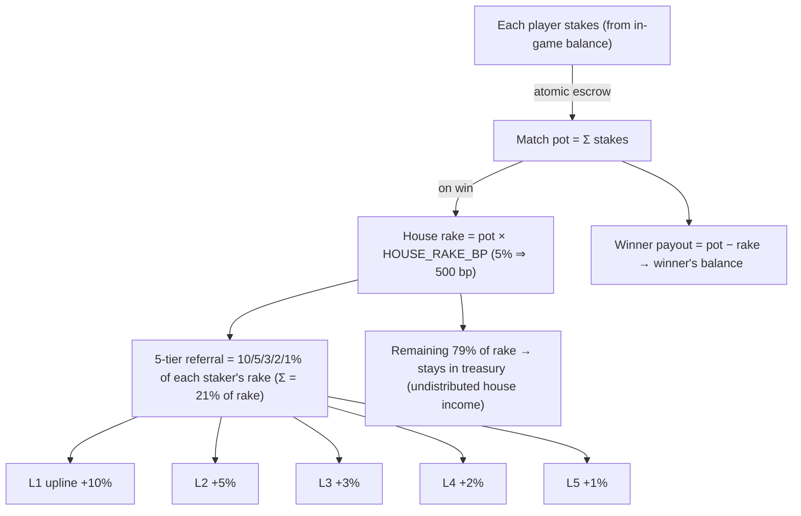

# Financial & referral system — audit + structure

What the code **actually does** with money, as a diagram, and how it compares to
the published tokenomics (`bombermeme-lending.vercel.app/tokenomics`, token **$BMB**).

Source of truth in code:
- Stakes/pot/rake/payout: `apps/server/src/room.ts` (settlement ~line 1329)
- Referral payout: `apps/server/src/referral.ts`
- Custody (deposit/withdraw): `apps/server/src/token.ts`
- Token constants: `packages/shared/src/constants.ts`
- Rake %: env `HOUSE_RAKE_BP` (basis points)

## Implemented money flow (what really happens)

### Custody (token in/out)
1. **Deposit:** player sends the SPL token to the treasury wallet → a watcher
   credits their **in-game `token_balance`** (atomic, deduped by tx signature;
   Postgres only is safe).
2. **Withdraw:** server debits in-game balance (overdraw-guarded) → treasury
   signs an on-chain transfer out.
3. The in-game balance is a **custodial ledger**; tokens physically live in the
   treasury wallet.

### A paid (TOKEN) match

- Referral credits land in each upline's in-game `token_balance` + a lifetime
  `referral_earned` counter. Cycle/self-referral guarded; referral only on
  **TOKEN** matches with rake > 0 (chips matches: same pot/rake math, **no
  referral**).
- The non-referral **79% of rake is NOT split or routed anywhere** — it simply
  isn't credited back to players, so it accumulates in the treasury wallet.

## Published tokenomics ($BMB) vs code

| Item | Page says | Code | Verdict |
| --- | --- | --- | --- |
| Token symbol | **$BMB** | `TOKEN_TICKER = "BGDF"` (test mint) | ❌ mismatch — fix at launch (constants, rebuild) |
| Network | Solana | Solana | ✅ |
| Total supply 1,000,000,000 | yes | not in game code | n/a (mint/launch, not server) |
| House rake **5%** | yes | `HOUSE_RAKE_BP` env | ⚠️ verify it's **500** |
| Rake → **5-Tier Referral 21%** | 10/5/3/2/1 | `REFERRAL_LEVEL_BPS=[1000,500,300,200,100]` | ✅ exact match |
| Rake → **Burn 25%** | yes | none | ❌ NOT implemented |
| Rake → **Real Yield 25%** | yes | none | ❌ NOT implemented |
| Rake → **Dev Treasury 24%** | yes | implicit "house keeps 79%" | ⚠️ partial/mislabeled (79% to one treasury, not 24%) |
| Rake → **DAO Impact 5%** | yes | none | ❌ NOT implemented |
| Allocations 88/5/4/3 | yes | n/a in game code | n/a (token launch) |
| On-chain split addresses (Yield/Dao/Burn/…) | placeholders | none | ❌ NOT implemented |

### Bottom line
- **Referral (21%)** is the **only** part of the advertised 5-way rake split that
  exists, and it matches exactly.
- **Burn / Real Yield / DAO** do not exist in code; **Dev Treasury** exists only
  as "whatever rake isn't paid to referrers" (≈79%), routed to a single treasury
  wallet — not the published 24%, and with no burn/yield/DAO routing.
- Ticker is **BGDF**, page is **$BMB**.

## To make reality match the page (decision needed)
Two honest options:
1. **Implement the split** — on settlement, divide the rake 25/25/24/21/5 and
   route burn (send to a burn address / reduce supply), real-yield (staking
   pool), dev-treasury, DAO to their respective wallets; referral stays as is
   (already 21%). Requires those wallet addresses + a staking/DAO design.
2. **Align the page to the implementation** — advertise: 5% rake, of which 21%
   referral and 79% treasury (R&D/operations), and drop burn/yield/DAO until
   built.

Either way, also: set `HOUSE_RAKE_BP=500`, and at launch switch the ticker/mint
to **$BMB** (`packages/shared/src/constants.ts`, rebuild, reset test balances).

---

## Update — rake-engine accounting + admin transparency (implemented)

The tokenomics is now a single source of truth in code and **visible in the
admin** so we can watch every pipe:
- `packages/shared/src/constants.ts`: `TOTAL_SUPPLY` (1B), `GAME_BUYBACK_TOKENS`
  (~120M seeded into the game, NOT the whole supply), `INITIAL_ALLOCATION_PCT`
  (88/5/4/3), `HOUSE_RAKE_BP_DEFAULT` (500), `RAKE_SPLIT_BPS`
  (burn 25 / yield 25 / devTreasury 24 / referral 21 / dao 5). `referral` is
  asserted to equal Σ `REFERRAL_LEVEL_BPS` (21%).
- `apps/server/src/treasury.ts`: on every paid-token settlement the rake is
  **accrued into its 5 buckets** (`recordRake`), shown in admin **💸 Rake
  Engine**. Referral is actually paid out; the other buckets are bookkeeping
  (the funds already sit in the treasury wallet).
- Admin **🏦 Treasury & supply**: total supply, in-game buyback, allocation %,
  and the wallet registry (`WALLET_TREASURY/MARKETING/DEVTEAM/BURN/YIELD/DAO`).
  The AI analyst receives all of this in its snapshot.

### Still NOT done (deliberate, needs decisions/keys)
- **On-chain movement of the non-referral buckets** — no real burn tx, no
  transfer to yield/DAO wallets yet. Today they accumulate in the one treasury
  wallet; the buckets are the accounting of how they *should* be swept.
- **Durable history** — bucket counters are since-restart (in-memory). Promote to
  a DB table when we need lifetime totals.
- **The 3 locked allocation wallets** (Treasury 5% / Marketing 4% / DevTeam 3%)
  — the addresses are configured/shown for transparency, but the actual **lock /
  3-month vesting is an on-chain step** (a Solana vesting program or multisig),
  not game-server code. Create the wallets now (even with the test token), set
  the env vars, and apply the lock at/just before launch.
