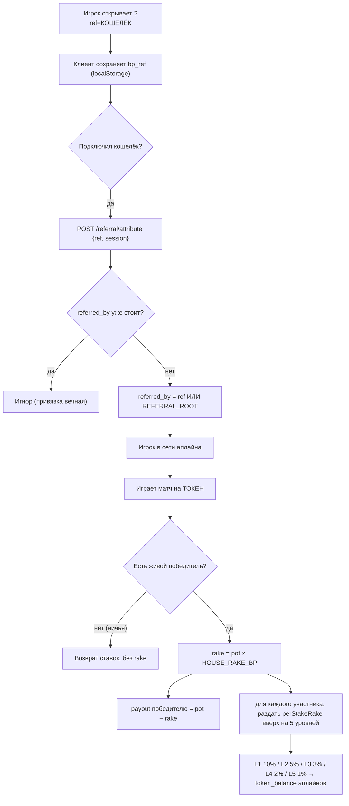
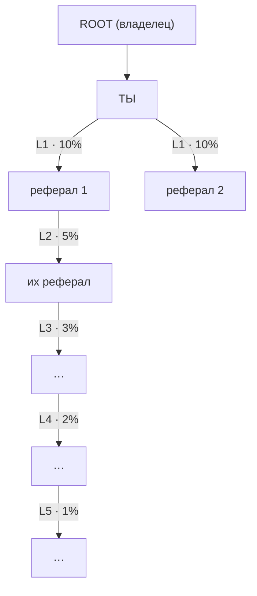

# Многоуровневая реферальная система — полное описание

> Источник истины: `apps/server/src/referral.ts`, `store.ts`, `room.ts`, `index.ts`,
> клиент `apps/client/src/main.ts` + `net/socket.ts`, конфиг `render.yaml`.
> Документ описывает то, что реально в коде на текущий момент.

---

## 1. Суть в одном абзаце

Каждый игрок может пригласить других по своей ссылке. Когда приглашённый (или
кто-то ниже по его ветке) **играет на реальный токен** и матч завершается
победителем, дом берёт комиссию (**rake**) с банка. **Часть этого rake**
раздаётся вверх по цепочке пригласивших — **на 5 уровней**. Это «пирамида»
доходов: ты получаешь % с активности всех, кого привёл, и всех, кого привели они,
до 5 колен вглубь. Выплаты — в **реальном токене**, начисляются в кошелёк-баланс
(их можно вывести).

Важно: **это работает только для матчей на реальный токен**. Игры на чипсы и
практика с ботами рефералку не питают (нет rake в токене).

---

## 2. Ключевые сущности и данные

У каждого профиля (`profiles`) есть три поля, на которых всё держится:

| Поле | Смысл |
|---|---|
| `referred_by` | Кошелёк пригласившего («аплайн»). `""` если никем не приглашён. Ставится **один раз**. |
| `referral_earned` | Счётчик: сколько всего токенов заработано на рефералке (lifetime, в base units). |
| `token_balance` | Кастодиальный токен-баланс. Реферальные выплаты падают сюда (можно вывести). |

Глобальные настройки (env, см. `render.yaml`):

| Переменная | Что задаёт |
|---|---|
| `HOUSE_RAKE_BP` | Размер rake в **basis points** (1% = 100 bp). Напр. `500` = 5%. **Если 0 — рефералка не платит ничего.** |
| `REFERRAL_ROOT` | Кошелёк-владелец = вершина пирамиды. К нему «подвешиваются» все, кто пришёл без реф-ссылки. |

Константа уровней (`referral.ts`):

```
REFERRAL_LEVEL_BPS = [1000, 500, 300, 200, 100]
                       L1    L2   L3   L4   L5
                       10%   5%   3%   2%   1%   (от суммы rake)
```

Сумма всех уровней = **21% от rake**. Остальные **79% rake дом оставляет себе**
(при условии, что цепочка из 5 аплайнов реально существует; недостающие уровни
дом тоже оставляет себе).

---

## 3. Как игрок становится твоим рефералом (атрибуция)

```
Шаг 1. Ссылка
  Ты открываешь «Invite & earn» → получаешь ссылку:
      https://<домен>/?ref=<твой_кошелёк>
  (в Telegram — startapp-параметр вида ref_<твой_кошелёк>)

Шаг 2. Переход
  Новый игрок открывает игру по твоей ссылке.
  Клиент вытаскивает ?ref=... (или ref_... из Telegram) и кладёт в
  localStorage как "bp_ref" — ещё до подключения кошелька.
      (apps/client/src/main.ts → captureRef)

Шаг 3. Привязка (один раз, после входа кошельком)
  Когда у игрока появляется подписанная сессия (подключил кошелёк),
  клиент вызывает POST /referral/attribute { ref, session }.
      (attributeReferralOnce → socket.ts attributeReferral)

Шаг 4. Сервер связывает
  /referral/attribute:
    - проверяет сессию → достаёт кошелёк игрока;
    - effectiveRef = ref ИЛИ REFERRAL_ROOT (если ссылки не было — аплайном
      становится владелец-рут);
    - нельзя пригласить самого себя (effectiveRef === wallet → отказ);
    - store.setReferrer(wallet, effectiveRef):
        ⮕ если referred_by уже стоит — НИЧЕГО не меняет (привязка вечная);
        ⮕ иначе записывает referred_by = effectiveRef.
    - после успеха клиент ставит localStorage "bp_ref_done" = 1, чтобы не
      дёргать привязку повторно.
```

Свойства атрибуции:
- **Однократность.** Как только `referred_by` установлен, он не меняется
  (кроме ручного админ-оверрайда `/admin/set-referrer`). Перепривязать игрока
  под себя позже нельзя.
- **Рут как fallback.** Игрок без реф-ссылки автоматически попадает под
  `REFERRAL_ROOT` (владельца). Если `REFERRAL_ROOT` не задан — он не попадает
  ни под кого (его активность рефералку никому не приносит).
- **Защита от самоссылки.** `wallet === ref` отклоняется.

---

## 4. Как и когда начисляются деньги (выплата)

Триггер — **завершение матча на реальный токен с живым победителем**
(`room.ts → settlePot`):

```
При победе (winner — человек с кошельком):
  rakeBp   = HOUSE_RAKE_BP
  rake     = floor(pot * rakeBp / 10000)        // комиссия дома со всего банка
  payout   = pot - rake                          // уходит победителю
  → победителю начисляется payout
  → recordWinnings (для лидербордов)

  ЕСЛИ валюта == TOKEN И rakeBp > 0:
    perStakeRake = floor(stakeBase * rakeBp / 10000)   // rake с ОДНОЙ ставки
    для КАЖДОГО участника матча (contributor):
        distributeReferralRewards(участник, perStakeRake)

При ничьей / отсутствии победителя:
  ставки возвращаются игрокам, rake НЕ берётся, рефералка НЕ платит.
```

`distributeReferralRewards(staker, rakeBase)` (`referral.ts`) — идёт вверх по
цепочке от игрока, до 5 уровней:

```
current = staker
seen = { staker }                     // защита от циклов
для level = 0..4:
    upline = profile(current).referred_by
    если upline пустой ИЛИ уже в seen:  стоп (вершина пирамиды / цикл)
    reward = floor(rakeBase * REFERRAL_LEVEL_BPS[level] / 10000)
    если reward > 0:
        creditReferral(upline, reward)     // upline.token_balance += reward
                                           // upline.referral_earned += reward
    current = upline
```

Тонкости:
- Выплаты идут **за каждого участника** матча, не только за победителя. То есть
  аплайны проигравших тоже зарабатывают с их ставок — деньги «капают» со всей
  активности сети.
- `rakeBase` для рефералки считается **с одной ставки** (`perStakeRake`), а не со
  всего банка. Сумма по всем участникам как раз равна общему rake, поэтому
  совокупные реф-выплаты ≤ 21% от общего rake.
- Всё в `referral.ts` обёрнуто в `try/catch` и `void` — **рефералка физически
  не может сломать расчёт матча/выплату победителю** (best-effort).
- Reward — это **запись в реестре**: токены уже лежат в treasury (это rake),
  поэтому начисление аплайну — чистая ledger-операция (увеличение его
  кастодиального баланса).

---

## 5. Числовой пример (чтобы было наглядно)

Условия: `HOUSE_RAKE_BP = 500` (rake 5%), 4 игрока, ставка = 10 000 токенов
каждый. У каждого участника есть полная цепочка из 5 аплайнов (A→B→C→D→E).

```
Банк (pot)            = 4 × 10 000 = 40 000
rake дома (5%)        = 40 000 × 5% = 2 000
Победителю (payout)   = 40 000 − 2 000 = 38 000

Рефералка считается с ОДНОЙ ставки:
perStakeRake          = 10 000 × 5% = 500   (это «реф-бюджет» с одного игрока)

Раздача вверх по цепочке ОДНОГО игрока:
  L1: 500 × 10% =  50
  L2: 500 ×  5% =  25
  L3: 500 ×  3% =  15
  L4: 500 ×  2% =  10
  L5: 500 ×  1% =   5
  ─────────────────────
  итого на цепочку = 105   (= 21% от 500); дом оставил 395 (79%)

В матче 4 участника → раздача происходит 4 раза:
  Всего rake             = 4 × 500 = 2 000
  Всего ушло рефералам   = 4 × 105 = 420
  Дом по факту оставил   = 2 000 − 420 = 1 580 (79%)
```

Если у участника цепочка короче (например, только L1 и L2 существуют) — уровни
L3–L5 просто не выплачиваются, и эти доли остаются у дома.

---

## 6. Граничные случаи и защиты

| Ситуация | Поведение |
|---|---|
| Матч на чипсы | Рефералка не платит (только TOKEN). |
| Практика / casual free | Нет ставок → нет rake → нет выплат. |
| `HOUSE_RAKE_BP = 0` | rake = 0, рефералка платит **ноль** (дашборд предупреждает). |
| Ничья / нет победителя | Ставки возвращаются, rake не берётся, рефералка молчит. |
| `referred_by` уже стоит | Повторная атрибуция игнорируется (привязка вечная). |
| Самоссылка (`ref == wallet`) | Отклоняется. |
| Цикл в цепочке (A→B→A) | `seen`-guard обрывает обход. |
| Игрок без ссылки | Привязывается под `REFERRAL_ROOT` (если задан). |
| Ошибка в раздаче рефералки | Глотается (try/catch), матч и выплата победителю не страдают. |
| Глубина > 5 | Обход останавливается на 5-м уровне. |

---

## 7. Что видит игрок (дашборд) и админ

**Игрок** (`/referral/stats?wallet=…` → модалка «Invite & earn»):
- `direct` — сколько людей он привёл напрямую (L1);
- `network` — массив из 5 чисел: размер его сети на каждом уровне L1..L5;
- `earned` — сколько всего токенов заработал на рефералке;
- `levels` — проценты уровней (10/5/3/2/1);
- `rakePct` — текущий % rake (для калькулятора прогноза дохода).

Размер сети на каждом уровне считается обходом дерева (BFS вниз):
в Postgres — рекурсивным CTE по `referred_by` с ограничением `depth < 5`
(`store.ts → referralStats`), в памяти — тем же обходом вручную.

**Админ** (`/admin/wallet`, `/admin/set-referrer`, обзор в `/admin`):
- посмотреть под кем сидит кошелёк, его баланс, заработок, размер сети;
- принудительно переустановить аплайн (`setReferrerAdmin` — форсит `referred_by`);
- глобальный обзор: размер всей сети, сколько выплачено, сколько «не привязанных»,
  раскладка уровней под рутом, топ-зарабатывающие.

---

## 8. Данные для визуализации (что отдаёт API)

Чтобы нарисовать «дерево/пирамиду», тебе достаточно этих полей:

- **Ребро дерева:** `profile.referred_by` (child → parent). Это весь граф.
- **Узел:** `wallet`, `name`, `referral_earned`, `direct` (число прямых детей).
- **Уровни от любого узла:** `network[0..4]` из `/referral/stats` (или обход
  `referred_by` вглубь на 5).
- **Корень:** `REFERRAL_ROOT`.
- **Экономика ребра:** доля уровня = `REFERRAL_LEVEL_BPS[level]/10000`, общий
  множитель дохода = `rakePct`.

Формула «сколько узел получает с одного токен-матча одного потомка на уровне L»:
```
reward_L = stake × (HOUSE_RAKE_BP/10000) × (REFERRAL_LEVEL_BPS[L]/10000)
```

---

## 9. Диаграмма (Mermaid) — поток и дерево

### 9.1. Поток «от приглашения до выплаты»



### 9.2. Пирамида уровней



---

## 10. Краткий конспект (для друга)

1. Делишься ссылкой `?ref=твой_кошелёк`.
2. Кто перешёл и зашёл кошельком — **навсегда** закрепляется за тобой
   (`referred_by`). Без ссылки человек уходит под владельца (`REFERRAL_ROOT`).
3. Зарабатываешь, только когда твоя сеть **играет на реальный токен** и матч
   заканчивается победителем. С чипсов/ботов — ничего.
4. Дом берёт rake (`HOUSE_RAKE_BP`). С него раздаётся вверх **5 уровней**:
   **10% / 5% / 3% / 2% / 1%**. Дом оставляет себе ≥79%.
5. Платят **за каждого** играющего в матче (не только за победителя), вверх по
   его цепочке.
6. Выплаты — реальный токен на твой баланс, выводимый.
7. Если `HOUSE_RAKE_BP = 0` — система настроена, но платит ноль (надо включить).
