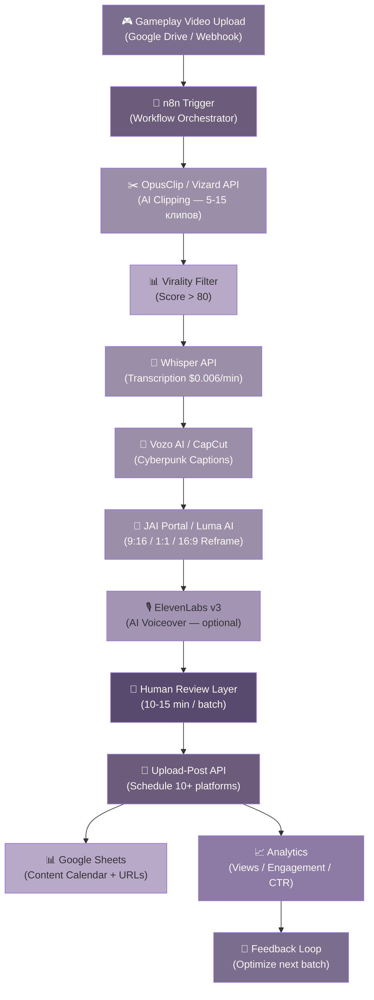

## 5. Автоматизация Контент-Пайплайна

Ручное производство 30-50 коротких клипов в месяц для пяти социальных платформ — это полная занятость для одного видеоредактора: нарезка, наложение субтитров, конвертация форматов, написание описаний, ручная публикация с оптимальным таймингом. AI-автоматизация превращает этот процесс в конвейер, где единственное действие оператора — загрузить исходное gameplay-видео и утвердить готовую партию перед выходом. Время на клип сокращается с 2-4 часов до 5-10 минут, а себестоимость — с $50-150 до $2-3 [^302^][^306^]. Для Bombermeme, которому необходимо ежедневное присутствие на TikTok, Instagram Reels, YouTube Shorts, X и Telegram, автоматизированный пайплайн — не оптимизация, а предусловие существования масштабного контент-маркетинга.

### 5.1 Архитектура пайплайна: Upload → AI Processing → Multi-Platform Output

#### 5.1.1 Вход: 5-минутный gameplay видео → выход: 30-50 готовых клипов для 5 платформ

Одна gameplay-сессия Bombermeme длительностью 5 минут содержит 10-15 значимых событий: эпичные убийства, тайминговые победы, clutch-розыгрыши, каскадные взрывы, забавные фейлы. Современные AI-инструменты для клиппинга анализируют видео и выявляют эти моменты автоматически — по аудиовсплескам (крик, смех), по визуальным паттернам (анимация взрыва, экран победы) и по игровым событиям (kill detection). OpusClip, обработавший к началу 2026 года более 172 млн клипов [^261^], WayinVideo со 2,6 млн часов, сэкономленных стримерам [^343^], и Taja AI со специализированным kill detection для гейминга — каждый из этих инструментов способен из одного 5-минутного ролика извлечь 5-15 клипов разной длительности [^344^].

Далее каждый клип проходит через цепочку обработки: транскрипция речи через Whisper API ($0.006/мин), генерация киберпанк-субтитров через Vozo AI (98,9% точность, 200+ стилей) [^279^], рефрейминг в вертикальный формат через JAI Portal (20-40 секунд на видео) [^270^] или Luma AI с динамическим object tracking [^271^], опциональная AI-озвучка через ElevenLabs v3 с эмоциональными тегами [^257^] и, наконец, публикацию через Upload-Post API на TikTok, Instagram, YouTube Shorts, X, Telegram и другие платформы [^336^]. Пайплайн превращает один загруженный файл в 30-50 готовых постов за время, которое раньше уходило на обработку одного ролика.

#### 5.1.2 Три фазы внедрения: MVP → Production → Scale

Внедрение автоматизированного пайплайна проходит через три фазы, каждая из которых добавляет качество и скорость при линейном росте затрат.

**MVP-пайплайн ($40-60/мес, недели 1-2).** На этом этапе приоритет — скорость запуска и валидация гипотезы. В стек входят Ssemble ($7,50/мес) с per-video pricing и доступным API для нарезки, CapCut Web (бесплатно) для базовых субтитров в киберпанк-стиле, JAI Portal с pay-per-use кредитами (~$20/мес) для рефрейминга и Upload-Post Free (10 загрузок/мес) для публикаций. Оркестрация — через self-hosted n8n на существующем сервере (бесплатно). Выход: 10-15 клипов/мес на 3-4 платформы с частичным ручным участием на этапах субтитров и планирования.

**Production-пайплайн ($82-140/мес, недели 3-6).** Переход на профессиональные инструменты: OpusClip Pro ($29/мес) с virality score и встроенным рефреймингом, Vozo AI ($15/мес) для продвинутых субтитров с 200+ стилями, ElevenLabs Creator ($22/мес) для AI-озвучки с 100K символов и Upload-Post Basic ($16/мес) для публикаций на 10+ платформах [^276^]. Оркестрация — n8n self-hosted на выделенном VPS ($10/мес), что при высоких объёмах обходится дешевле Make.com и Zapier [^277^]. Транскрипция через Whisper API добавляет ~$6/мес за 1 000 минут обработки. Выход: 30-50 клипов/мес на все платформы с минимальным ручным вмешательством.

**Scale-пайплайн ($200-360/мес, месяц 2+).** Максимальная автоматизация: WayinVideo Unlimited ($79/мес) — gaming-оптимизированная нарезка без лимитов, Creatomate ($59/мес) для массовой шаблонной генерации 100+ видео через CSV-файл [^289^], ElevenLabs Pro ($99/мес) с 600K символов и приоритетным API, Upload-Post Pro ($33/мес) с whitelabel и 25 профилями, Aidelly MCP ($19/мес) для интеграции AI-агента в процесс публикации через Model Context Protocol [^265^]. Выход: 100+ клипов/мес, полностью автономная работа с human review layer.

#### 5.1.3 ROI: от 95% экономии времени до 50-кратного снижения стоимости

Цифровое выражение эффекта автоматизации впечатляет. Ручное создание одного короткого клипа от нарезки до публикации занимает 2-4 часа при стоимости $50-150 (включая оплату редактора и распределение по платформам). AI-пайплайн в production-конфигурации сокращает это время до 5-10 минут (95% экономия), а стоимость — до $2-3 за клип (50-кратное снижение) [^302^]. Sovran, платформа для модульного видеопроизводства, демонстрирует median render time в 85 секунд против 4-6 недель у агентств — снижение стоимости варианта с $100-500 до $20-200 [^286^]. Для контент-команды, производящей 30 клипов в месяц, это разница между $4 500 и $112 в прямых затратах — и между 120 часами ручного труда и 5 часами контроля качества.

Таблица ниже сравнивает производственные метрики трёх подходов к контент-производству при объёме 30 клипов в месяц.

| Метод | Стоимость за клип | Ежемесячный бюджет (30 клипов) | Время на клип | Клипов в неделю | Покрытие платформ |
|:---|:---:|:---:|:---:|:---:|:---:|
| Ручное создание (in-house) | $50-150 [^286^] | $1,500-4,500 | 2-4 часа | 3-5 | 2-3 |
| Фриланс-редактор | $30-100 | $900-3,000 | 1-2 часа | 5-10 | 3-5 |
| AI-пайплайн (бюджет) | $1-2 | $20-40 | 5 мин | 10-15 | 4-6 |
| AI-пайплайн (стандарт) | $4-5 | $112-140 | 2 мин | 20-30 | 8-10 |
| AI-пайплайн (премиум) | $11-12 | $329-360 | 1 мин | 50-100 | 10+ |

Анализ таблицы показывает, что стандартный AI-пайплайн при стоимости $112-140/мес заменяет полную рабочую неделю (30-40 часов) видеоредактора. Ключевой вывод — не в абсолютной экономии $1 000+, а в том, что контент-маркетинг становится масштабируемым: удвоение объёма с 30 до 60 клипов добавляет лишь $30-50 к прямым затратам (стоимость API-вызовов), тогда как ручное производство потребовало бы удвоения штата. Это меняет контент-маркетинг из фиксированной статьи расходов в переменную с маржинальной себестоимостью, стремящейся к нулю.

### 5.2 AI-инструменты по этапам пайплайна

Каждый этап обработки — нарезка, субтитры, озвучка, рефрейминг, публикация — имеет собственный сегмент инструментов с различным соотношением цена-качество и степенью API-доступности. Выбор конкретного инструмента определяется не только качеством выхода, но и возможностью интеграции в единый workflow через webhooks и REST API.

| Этап | Инструмент | Стоимость | API-доступ | Ключевая метрика | Best for |
|:---|:---:|:---:|:---:|:---|:---|
| Нарезка | OpusClip | $15-29/мес | Enterprise only | 172M+ клипов [^261^] | Лучший virality score, brand templates |
| Нарезка | WayinVideo | $19-79/мес | Нет | 2.6M+ часов сэкономлено [^343^] | Gaming-оптимизация (LoL, Valorant) |
| Нарезка | Vizard AI | $14.5/мес | Self-serve | Text-based editing | Максимальная автоматизация через API |
| Нарезка | Ssemble | $7.5-15/мес | Да | Per-video pricing | MVP-фаза, бюджетный старт |
| Субтитры | Vozo AI | От $15/мес | Да | 98.9% accuracy, 200+ стилей [^279^] | Киберпанк-стили, 127+ языков |
| Субтитры | CapCut Web | Бесплатно | Нет | 8 типов субтитров [^284^] | Быстрый старт без бюджета |
| Субтитры | WayinVideo | Бесплатно 60 мин/день | Нет | 100+ стилей | Batch-обработка gaming-роликов |
| Voiceover | ElevenLabs v3 | $5-99/мес | Да | 70+ языков, эмоции [^257^] | Профессиональная озвучка |
| Voiceover | Vocallab | ~$15/мес | Нет | 1 point = 1 сек [^258^] | Специализация на gaming-контенте |
| Рефрейминг | JAI Portal | Pay-per-use | Да | 20-40 сек на видео [^270^] | Быстрая конвертация форматов |
| Рефрейминг | Luma AI | Pay-per-use | Да | AI object tracking [^271^] | Динамичный геймплей |
| Постинг | Upload-Post | $16-350/мес | REST | 10+ платформ [^336^] | Unified API, AI Shorts Uploader |
| Постинг | Aidelly | $19+/мес | REST + MCP | AI-first scheduling [^265^] | Agentic workflow через MCP |
| Оркестрация | n8n self-hosted | Бесплатно | 200+ интеграций | $10 VPS [^277^] | Полный контроль, no per-op fees |

Эта таблица — карта выбора для каждой фазы внедрения. На MVP-фазе приоритет отдаётся инструментам с бесплатным tier или минимальным входным порогом (CapCut, Ssemble, JAI Portal free credits, Upload-Post free tier). При переходе в Production заменяются те компоненты, где качество критично для engagement: OpusClip вместо Ssemble (лучший virality score), Vozo AI вместо CapCut (профессиональные стили субтитров), ElevenLabs вместо ручной озвучки (масштабируемость). На фазе Scale добавляются Aidelly MCP для агентных workflow и Creatomate для массового рендера шаблонов.

#### 5.2.1 Нарезка: от virality score до kill detection

OpusClip остаётся доминирующим игроком с показателем 172M+ обработанных клипов [^261^] и фичей ClipAnything — универсальной моделью, которая выделяет значимые моменты из любого видео. Его virality score оценивает каждый сгенерированный клип по вероятности вирусного распространения, что позволяет фильтровать выход перед дальнейшей обработкой. Для Bombermeme критично: API OpusClip доступно только на Enterprise-плане [^30^], что делает его ручным инструментом на MVP-фазе и требует обходных путей для автоматизации.

WayinVideo специализируется на гейминг-контенте и заявляет о 15-20 часах экономии в неделю для стримеров [^344^]. Его алгоритмы оптимизированы под распознавание паттернов популярных игр (League of Legends, Valorant, Fortnite, GTA V), что для Bombermeme означает необходимость адаптации, но демонстрирует зрелость gaming-специфичных моделей. Vizard AI выделяется self-serve API, доступным без sales calls — критичное преимущество для no-code пайплайна [^365^]. Ssemble предлагает минимальный порог входа ($7,50/мес) с API на всех планах и game overlays, что делает его оптимальным стартовым выбором [^30^].

#### 5.2.2 Субтитры: киберпанк-стиль как отличительный знак

85% видео в социальных сетях просматривается без звука [^279^], что делает субтитры обязательным, а не опциональным элементом. Для Bombermeme с его киберпанк-эстетикой стиль субтитров — часть бренда: glow-эффекты, bold шрифты, uppercase impact captions с word-by-word синхронизацией.

Vozo AI предлагает 200+ стильных шаблонов с анимированными эффектами и поддержку 127+ языков при заявленной точности транскрипции 98,9% [^279^]. Это делает его приоритетным выбором для production-фазы, когда качество визуального оформления напрямую влияет на retention. CapCut Web (бесплатно) поддерживает восемь типов субтитров, включая dynamic animated captions и uppercase impact captions — последние идеальны для гейминг-контента с их "grab-you-by-the-throat" визуальным языком [^284^]. WayinVideo предоставляет 60 минут бесплатной обработки в день с десятками анимированных стилей — достаточно для MVP-фазы с умеренным объёмом.

#### 5.2.3 Voiceover: эмоциональный слой через ElevenLabs v3

AI-озвучка служит двум целям в контентной стратегии Bombermeme. Первая — no-commentary рекапы геймплейных сессий, где энергичный голос за кадром повышает retention и добавляет narrative layer к чистому геймплею. Вторая — многоязычная локализация: один и тот же клип может быть озвучен на английском, испанском, корейском и японском для максимального географического охвата.

ElevenLabs v3 остаётся золотым стандартом с поддержкой 70+ языков и эмоциональными тегами вроде [excited] и [whispers], которые дают детальный контроль над интонацией [^257^]. API стоит $0.05-0.18 за минуту сгенерированного аудио — для 30 клипов по 60 секунд это $1.5-5.4/мес, входящие в лимит Creator-плана ($22/мес). Vocallab специализируется на гейминг-контенте с моделью оплаты 1 point = 1 секунда аудио [^258^], но отсутствие API ограничивает его использование в fully automated workflow.

#### 5.2.4 Рефрейминг: от 16:9 к 9:16 за секунды

Gameplay Bombermeme записывается в горизонтальном формате 16:9, тогда как TikTok, Instagram Reels и YouTube Shorts требуют вертикального 9:16. Ручная конвертация — кроп, repositioning, проверка, что важные элементы (игровой персонаж, взрывы, HUD) не выходят за кадр — занимает 5-15 минут на видео.

JAI Portal конвертирует видео в новые аспект-рейтии за 20-40 секунд, используя AI-инпейнтинг вместо простого кропа [^270^] — технология дорисовывает недостающие части кадра, сохраняя композицию. Luma AI Reframe автоматически определяет ключевой субъект и динамически корректирует кадрирование для каждой сцены, что критично для динамичного Bomberman-геймплея с быстрыми перемещениями [^271^]. OpusClip включает встроенный рефрейминг в Pro-план — один инструмент покрывает и нарезку, и конвертацию форматов.

#### 5.2.5 Постинг: единый API для 10+ платформ

Последняя миля пайплайна — публикация. Upload-Post предлагает unified REST API для TikTok, Instagram, YouTube, LinkedIn, Facebook, X, Threads, Pinterest, Reddit и Bluesky [^336^], устраняя необходимость в отдельной OAuth-интеграции и compliance-проверке для каждой платформы. Стоимость от $16/мес делает его доступным даже на MVP-фазе. Aidelly выделяется интеграцией через MCP (Model Context Protocol), позволяя AI-агенту писать пост, проверять контент-календарь и планировать публикацию без участия человека [^265^] — это архитектура будущего, на которую стоит ориентироваться при масштабировании.

### 5.3 No-code архитектура пайплайна

#### 5.3.1 Схема пайплайна: от триггера до публикации

Полностью автоматизированный workflow Bombermeme строится на связке n8n (оркестрация) + Upload-Post (дистрибуция), с AI-инструментами на каждом этапе обработки. Архитектура представляет собой линейный pipeline с feedback loop на аналитику:

Триггером служит загрузка нового gameplay-видео в облачное хранилище (Google Drive) или webhook от игрового сервера при завершении матча. n8n перехватывает событие и инициирует цепочку: вызов API нарезки, фильтрация клипов по virality score (только те, что превышают порог 80 из 100), транскрипция аудио, генерация субтитров, рефрейминг в три формата (9:16 для TikTok/Reels/Shorts, 1:1 для Instagram Feed и X, 16:9 для YouTube), опциональная озвучка и планирование публикации через Upload-Post API с оптимальным таймингом для каждой платформы. Готовые URL записываются в контент-календарь (Google Sheets), а команда получает уведомление в Discord для финального review.

#### 5.3.2 Self-hosted n8n: бесплатная оркестрация с полным контролем

n8n (произносится "n-eight-n") — open-source платформа workflow-автоматизации с визуальным конструктором, 200+ встроенными интеграциями и критически важной для высоких объёмов возможностью self-hosting [^276^]. В отличие от Zapier и Make.com, которые взимают плату за каждую операцию, self-hosted n8n на VPS стоимостью $10/мес не имеет лимитов на количество выполнений [^277^]. Готовый шаблон n8n уже реализует end-to-end pipeline: от идей в Google Sheets до готовых видео с AI-генерацией и мультиплатформенной публикацией [^276^] — его адаптация под Bombermeme gameplay → clips → publish занимает 1-2 дня.

Кросс-инсайт из анализа инфраструктуры Bombermeme показывает синергию: игра уже использует Node.js/TypeScript бэкенд в Docker-конфигурации [^7^]. Добавление n8n-сервиса в существующий docker-compose требует минимальных изменений — game backend и content pipeline делят инфраструктуру, снижая совокупную стоимость владения и упрощая DevOps.

#### 5.3.3 Fallback: полуавтоматизированный workflow через CapCut Desktop Batch

Не все AI-инструменты предоставляют API. CapCut Web, WayinVideo, OpusClip на non-Enterprise планах — эти инструменты требуют ручного интерфейса. Для MVP-фазы, когда API-доступ ещё не настроен, применяется гибридный подход: n8n автоматизирует те этапы, где API доступен (Whisper для транскрипции, Upload-Post для публикации, Google Sheets для трекинга), а оператор выполняет нарезку и субтитры через CapCut Desktop в batch-режиме. CapCut поддерживает batch-обработку нескольких видео с применением одного шаблона субтитров — оператор загружает папку с клипами, выбирает киберпанк-стиль, и все ролики обрабатываются единообразно. Этот semi-automated workflow снижает экономию времени с 95% до 70%, но сохраняет консистентность качества и стоимость в рамках $40-60/мес на MVP-фазе.

#### 5.3.4 Quality control: human review layer перед публикацией

Полная автоматизация без контроля качества рискована: AI может неправильно распознать игровой контекст, субтитры могут содержать ошибки в игровой терминологии, virality score не учитывает актуальность контекста (например, упоминание отменённого турнира). Human review layer — обязательный этап между генерацией и публикацией.

Оператор тратит 10-15 минут на батч из 5-10 клипов: проверка субтитров на опечатки и игровую терминологию, визуальная оценка рефрейминга (игровой персонаж остаётся в кадре), финальное одобрение расписания публикаций. Этот контроль снижает риск публикации некачественного контента на 90% при минимальном временном вкладе. При масштабировании до 100+ клипов/мес review можно частично делегировать AI-агенту через Aidelly MCP с эскалацией к человеку только при низком confidence score.

Пайплайн, описанный в этой главе, превращает контент-маркетинг из функции, требующей выделенной команды, в модуль, который один оператор управляет за 2-3 часа в неделю. Совокупная стоимость $82/мес в production-конфигурации заменяет $3 000+/мес на фриланс-редакторов и даёт выход 30-50 клипов, покрывающих все целевые платформы Bombermeme. Это не просто экономия — это смена парадигмы: контент становится commodity, который масштабируется так же легко, как серверные мощности, позволяя команде фокусироваться на стратегии и креативе, а не на рутине производства.
