# Match state machine

A room walks through these phases. The server owns all transitions; clients
just render the phase they're told about.

```mermaid
stateDiagram-v2
    [*] --> LOBBY
    LOBBY --> COUNTDOWN: 4 players OR (>=1 human and 15s elapsed; fill bots)
    COUNTDOWN --> PLAYING: countdown reaches 0 (3s)
    PLAYING --> SUDDEN_DEATH: match clock hits 60s
    PLAYING --> END: <=1 player alive
    SUDDEN_DEATH --> END: <=1 player alive (walls close to center)
    END --> [*]: room lingers 10s, then is reclaimed

    note right of PLAYING
        20 Hz authoritative tick:
        move -> slide kicked bombs ->
        fuses/detonations (chain) ->
        decay fire -> deaths + pickups ->
        pass-through bookkeeping ->
        idle-kick -> win check
    end note
```

## Timings (from `packages/shared/constants.ts`)

| Constant | Value |
| --- | --- |
| `TICK_RATE` | 20 Hz |
| `COUNTDOWN_MS` | 3000 |
| `MATCH_LENGTH_MS` | 90000 |
| `SUDDEN_DEATH_AT_MS` | 60000 |
| `SUDDEN_DEATH_STEP_MS` | 2000 (one spiral wall tile) |
| `BOMB_TIMER_MS` | 2500 |
| `EXPLOSION_LIFETIME_MS` | 400 |
| `END_SCREEN_MS` / `ROOM_LINGER_MS` | 5000 / 10000 |
